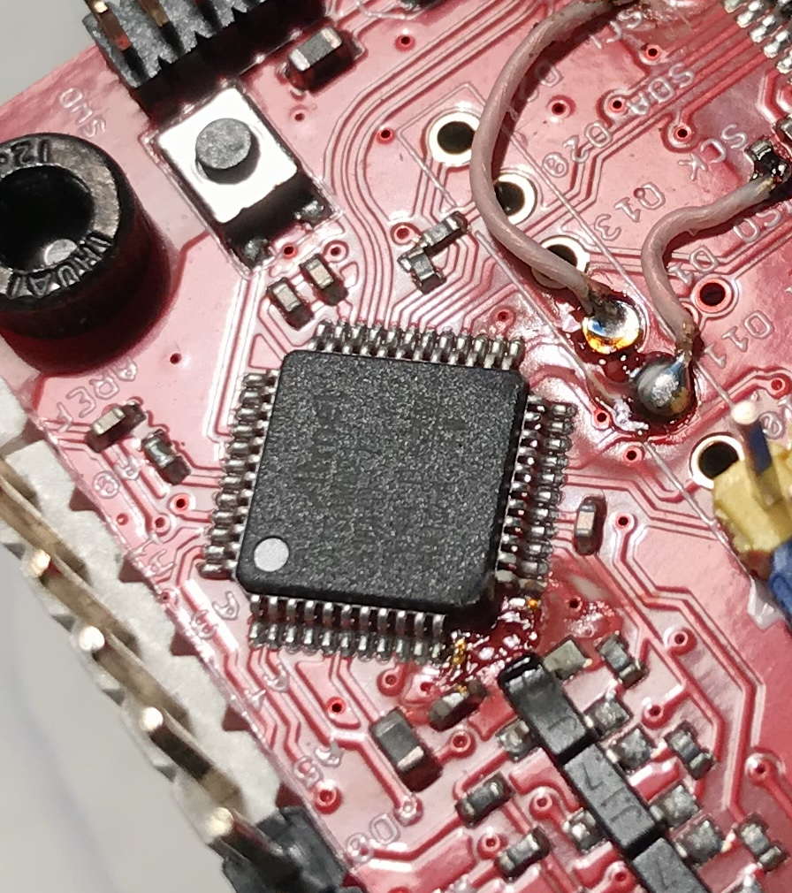

Это вариант доработки китайской Мехадуино (купленной на алиэкпересс). Полученные мной 3 платы с моторами были неисправны. На процессоре ATSAMD21 G18A-U 1644 были нерабочие два пина которые выведены на Vref1 и Vref2 драйвера шагового мотора. Поэтому исправил прошивку. Отрезал ноги процессоар и кинул 2 пекремычки. Платы ожили. Доработка видна на фото. 

New release 11/26/2018!  The calibration table is now stored in flash memory!  (Many thanks to osresearch!) We've also fixed a couple of small bugs.
Here are some preliminary instructions on how to get your Mechaduino up and running.  For more details, see the Mechaduino Manual above!

## Bootloader:
You will need to make sure your Mechaduino has the latest Arduino Zero bootloader.  If you got your Mechaduino from Tropical Labs, it will already have this! Otherwise you will need an Atmel-ICE or similar SWD programmer...

## Firmware:

Compile the Mechaduino firmware in the Arduino IDE and upload to your Mechaduino.  (Mechaduino will appear as an Arduino Zero.)  

New firmware is in the default "master" branch. Older versions are available [here](https://github.com/jcchurch13/Mechaduino-Firmware/releases). 

## Calibration Routine:

The first thing you will need to do is run the encoder calibration routine.

With the Mechaduino connected to your computer, open a serial monitor (115200 baud) in the Arduino IDE.  You will need to provide V+ to the Mechaduino to power the motor drivers (needed to calibrate).  A menu should appear explaining the basic commands (you can call the menu up at any time by typing 'm').  Type "s" and press enter a couple times to verify that everything is working.  The Mechaduino should step like a stepper.  It is currently in open loop mode.  press "d" and the stepping direction will change.  

Now, make sure nothing will touch the Mechaduino’s shaft during the calibration routine. If possible, completely disconnect any load that is attached to the Mechaduino’s shaft.  Type "c" to start the calibration routine. The Mechaduino will now step through all full steps to calibrate the encoder. In the latest version of the firmware, the calibration table will automatically be stored in non-volatile flash memory. When this routine is complete, your Mechaduino is now calibrated!

## Basic Commands:

As long as you have "serialCheck();" in your main loop, you can use the following built in commands to control the mechaduino from a serial monitor:

  
s - step (steps one full step in open loop mode)

d - dir (changes step direction in open loop mode)

p - print angle [step count] , [assumed angle] , [encoder reading]

c - calibration routine

e - check encoder diagnostics

q - parameter query (prints current PID values and cal table)

x  -  position mode

v - velocity mode

t - torque mode

y - enable control loop (enter closed loop mode)

n - disable control loop (go back to open loop mode)

r - enter new setpoint (new setpoint for control loop)

j - step response

k - edit controller gains*

g - generate sine commutation table

m - print main menu

  ...see serialCheck() in Utils for more details
 

##License

All Mechaduino related materials are released under the
[Creative Commons Attribution Share-Alike 4.0 License](https://creativecommons.org/licenses/by-sa/4.0/)
